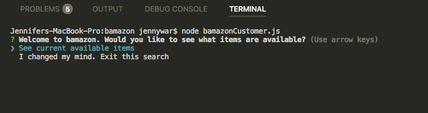
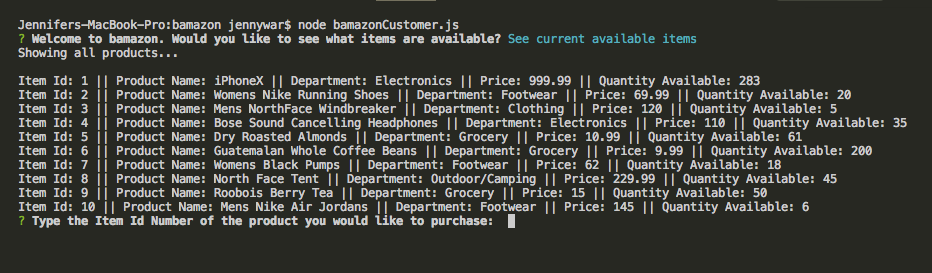
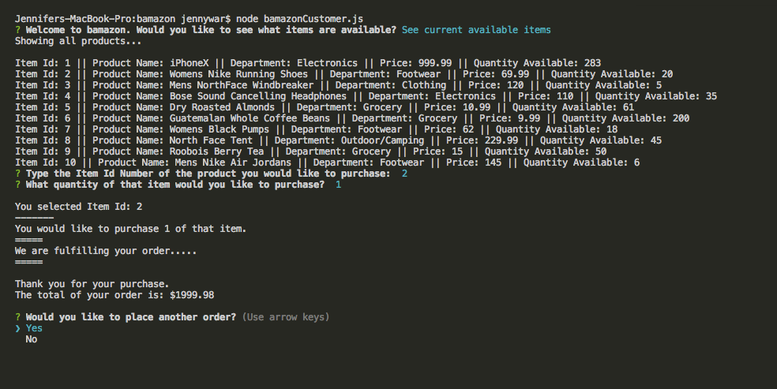
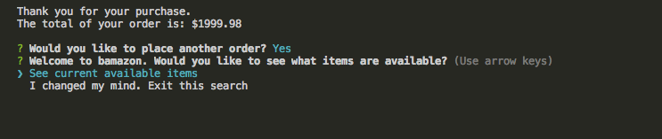
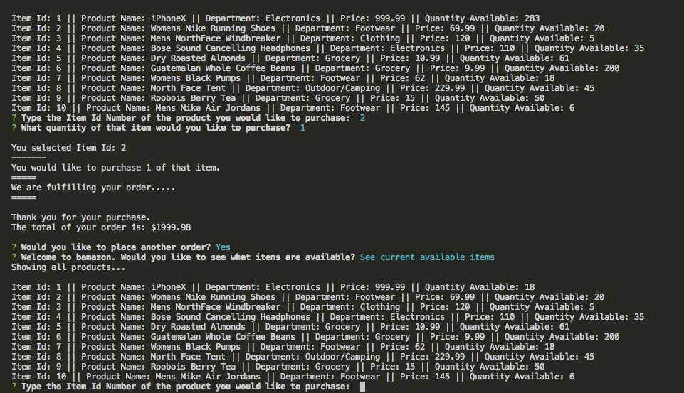
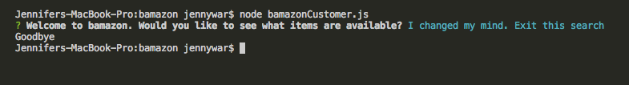
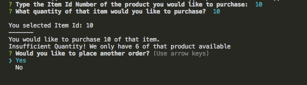

# BAMAZON
## Welcome to an Amazon like Nodejs store where a customer can purchase items stored in a MySQLWorkbench database.

-----------------------------------------
## How it Works:

- Clone the repo
- Make sure that npm install and npm inquirer have been installed
- by running node bamazonCustomer.js in the command line you will be prompted to either see the current available items for purchase or to exit the search

- If the user chose to see what items are available for sale they will see a list of available options:

- You are able to select the Item Id number of the product you would like to purchase as well as the quantity of that item you would like to purchase:

- Once the Item Id and quantity have been selected a function is run to make sure there are enough items in stock to fulfill the order. If there are enough items another function will complete that order and give the user the total price of their purchase:

- The user will then be asked if they would like to make another purchase or exit the search:

- If the user would like to continue shopping the list with the updated inventory availble will be shown:

- If the user has decided they would like to exit the search the connection to the database will end:

- If the user is trying to purchase more items than are available in the stock inventory they will be told there is an insufficient quantity to fulfill the order and they will be asked if they would like to start over or exit the search

